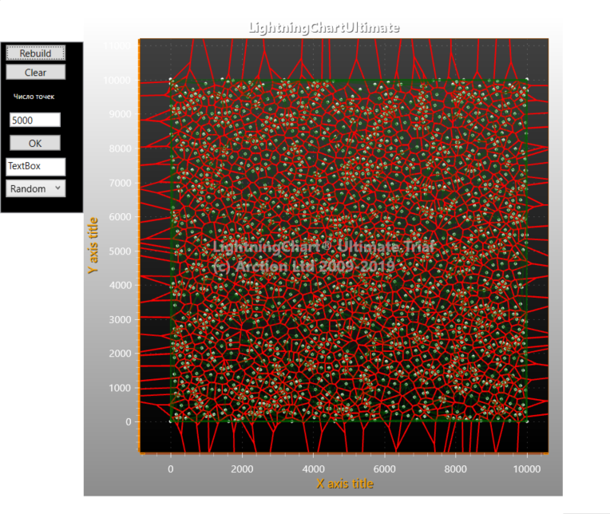
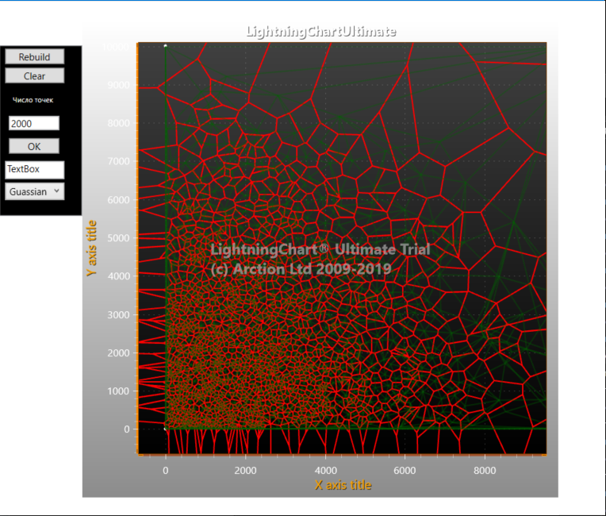
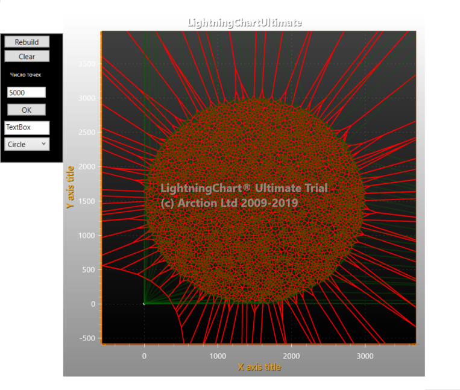

# C# Delaunay triangulation + Voronoi Diagram

Данный проект был мною оптиммизирован, был добавлен новый функционал:
* Оптимизация на 330+% (в некоторых местах до 860%)
* Была заменена стандартная медленная библиотека рисования WPF на быструю библиотеку Lightning(В демо версии), для данного варианта была создана отдельная ветка- Lightning
* Был добавел новый функционал для построения точек в круге
* Был добавел новый функционал для построения точек методом распределения Гаусса
* Возможность через интерфейс задать кол-во точек для построения

